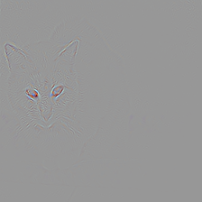

#Simple Linear Iterative Clustering
run slics.py to generate segmented images. My image is *my_superpixel_image.png* and the skimage one is *skimage_superpixel_image.png* 

||
|---|
|*This is my image.*|

||
|---|
|This is the skimage slic image.|

The biggest con of my implementation is that it is very slow. It uses for loops to iterate over centroids and assign labels, which does not take advantage of numpy's parallel processing.
Additional problems with it are that it does not initialize centroids to the lowest gradient positions, which could noise to interfere with the clusters obtained.
Also, I do not enforce connectivity.
However, my implementation is much shorter.

#Visual Attention in Deep Neural Networks


## Demo 1


This image is unmodified.

|              Predicted class               |                       #1 tabby                        |                       #2 Egyptian_cat                        |                       #3 tiger cat                        |
| :----------------------------------------: | :---------------------------------------------------: | :----------------------------------------------------------: | :-------------------------------------------------------: |
|        Grad-CAM                            |         |         |         |
|          Vanilla backpropagation           |                |                |                |
|    Guided Grad-CAM                         |  |  |  |


This image has 3 concentric red hexagons to fool the neural network.

|              Predicted class               |                       #1 jeans                        |                       #2 mousetrap                        |                       #3 pillow                        |
| :----------------------------------------: | :---------------------------------------------------: | :----------------------------------------------------------: | :-------------------------------------------------------: |
|        Grad-CAM      |         |         |         |
|          Vanilla backpropagation           |                |                |                |
|    Guided Grad-CAM    |  |  |  |


## Demo 2

Grad-CAM maps for "bull mastiff" class, at different layers of ResNet-152 (hardcoded).
This image is unmodified.

|            Layer             |                     ```relu```                      |                     ```layer1```                      |                     ```layer2```                      |                     ```layer3```                      |                     ```layer4```                      |
| :--------------------------: | :-------------------------------------------------: | :---------------------------------------------------: | :---------------------------------------------------: | :---------------------------------------------------: | :---------------------------------------------------: |
| Grad-CAM |  |  |  |  |  |


Grad-CAM maps for "bull mastiff" class, at different layers of ResNet-152 (hardcoded).
This image has 3 concentric red hexagons to fool the neural network

|            Layer             |                     ```relu```                      |                     ```layer1```                      |                     ```layer2```                      |                     ```layer3```                      |                     ```layer4```                      |
| :--------------------------: | :-------------------------------------------------: | :---------------------------------------------------: | :---------------------------------------------------: | :---------------------------------------------------: | :---------------------------------------------------: |
| Grad-CAM |  |  |  |  |  |
